# The Unnamed 3D Thingy

*Design notes — completed edition. Parts 1–4 are the original notes (text unchanged, figures re-extracted).
Parts 5–13 complete the project: the theory of why the construction works, a verified reference design,
step-by-step instructions for Autodesk Fusion, an automated generator, and print-ready STL files that have
been checked for correctness by simulation.*

---

## Part 1 — The puzzle (original notes)

Years ago, my boss shared with me a book he wrote, in digital format; its main topic is critical
thinking training. There is a section about a mental exercise, that I am summarizing as follows:

There is a block composed of two different types of wood, each about an inch in height, that
were mated in a manner that ensured no gaps of air between them. From every side, the
assembly looks the same:

The two layers of wood can be separated from each other by a single simple movement, there
is no glue or any other adhesive or mechanical inhibitor involved. They could be reunited with
the same type of motion.

In the book, the solution to this puzzle is exactly the one beautifully designed by Roger:

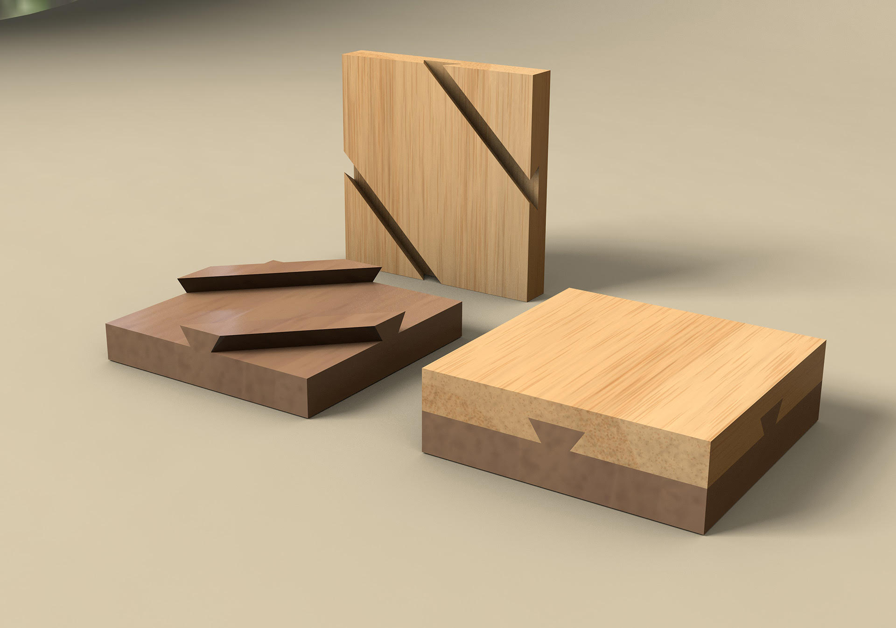

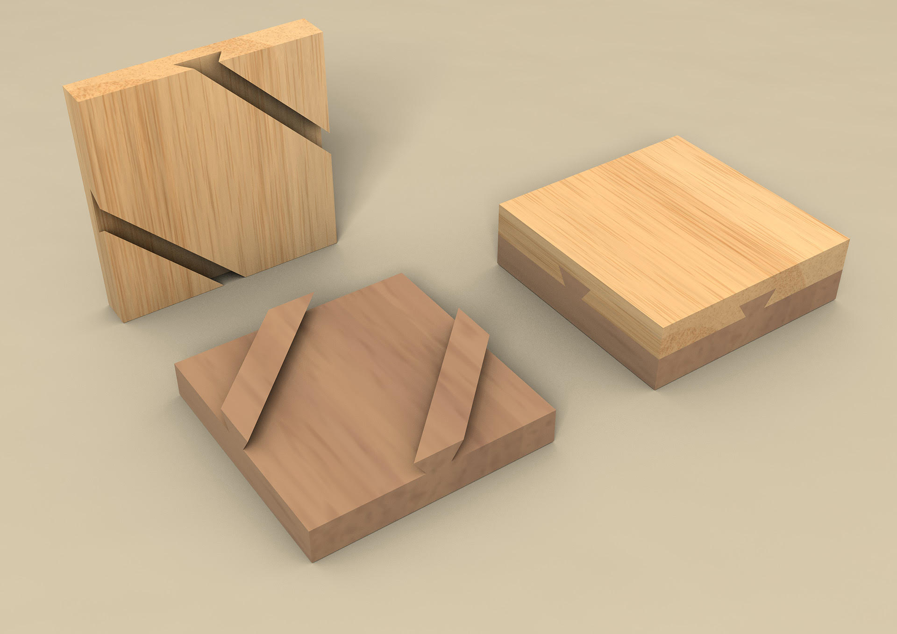

(I really love it!)

My observation back then, which I rummaged a bit more over time, is that this is not *the
solution*, because in fact the problem admits infinite solutions. To prove it, I created a different
one using 3D Builder on Windows, I had it 3D printed and gave it to my boss around Christmas
as a "semi-parting" gift, as he is semi-retiring:

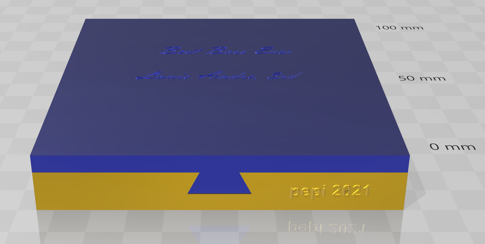

As it can be easily verified, Roger's solution and mine belong to a family of solutions which
consist of two grooves each connecting one of the side keys to another, where the center of the
curve that they describe can be arbitrarily set from somewhere between the middle of the
square and one of the corners, then to a corner (as in my solution), then beyond the corner
all the way to infinity (Roger's solution).

There are of course infinite solutions in this family, but they are still very much limited in their
shape; in particular, there is no additional information that can be encoded in the shape itself.

## Part 2 — The generalized method (original notes)

After giving it a bit of thought, I found out that we can do much better than that.
In fact, any amount of information, such as, for instance, QR codes or Roger's portrait, can be
encoded *inside* the apparatus without violating the requirements. Furthermore, the method can
be extended from four to any number of sides ≥ 3.

In a nutshell, the process is as follows:

- define a base shape for the half side *(original image lost from the PDF — see the dimensioned
  profile in Part 7, which plays the same role)*
- mirror it to generate a full side
- compose the sides to build the "polygon box" of choice, a square in this example but of
  course it can be anything ≥ 3

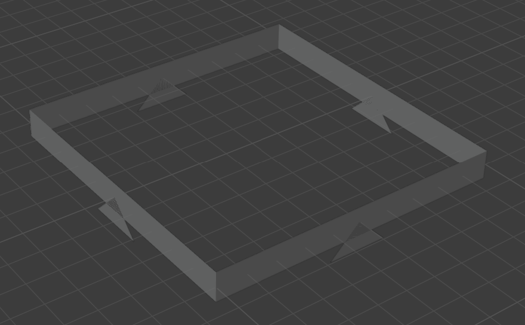

- extrude the box along a line with constant curvature, which can be arbitrary with some
  constraints, e.g. it cannot lie on a plane that is parallel to any of the sides. In this
  example, the extrusion is carried out along a straight line that is not parallel to any of the
  axes of the square prism, but it could be any other from an infinity of possible curves

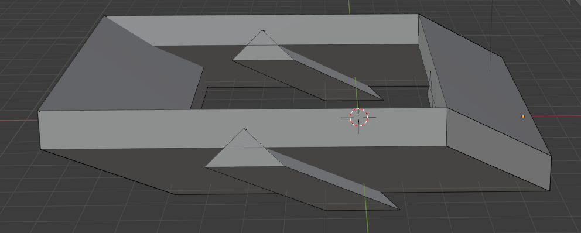

- compose the 3d boundary box for the complete assembly, that is, a prism that matches
  the contour of the "polygon box" and extends to surround the volume of the missing
  element
- crop the extrusion using the boundary box

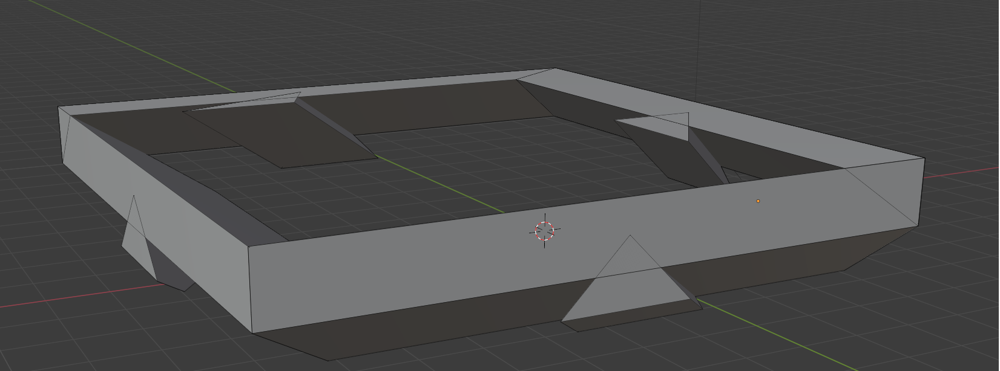

Now, all the mandatory features are implemented; all we are left to do is to place a "lid" on top of
the box, and then create the complementing part by filling the space below. That means that we
still have a lot of degrees of freedom in designing the rest of the boundary between the two
parts, and thus we could encode an arbitrary amount of information there.

The key difference between this method and the solutions mentioned at the beginning of the
document is that, by moving along three axes instead of two, we were able to give each side its
own independent groove, which in turn makes it possible to change arbitrarily the number of
sides.

Putting it all together, I built a quick complete example using Blender up to the step above, and
then assembling it with 3D Builder, using .stl for the exchange:

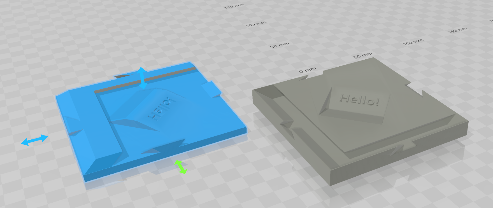

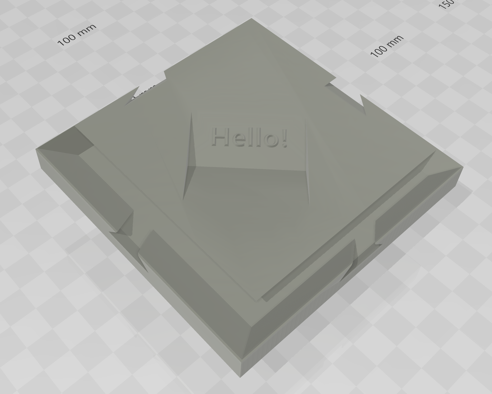

## Part 3 — A graduation U3T ("Unnamed 3D Thingy") for Francesco (original notes)

Based on the above, we have a little project for the upcoming graduation in the family — I know, it
sounds impossible! I wonder, could it be reused elsewhere? ;)

The basic idea: starting from the "Hello" design in the previous page, adding two enhancements:

- Carrying out the extrusion of the "polygon box" along a nice, creative curve instead of a
  predictable and boring straight line
- Maximize use of the available space in the box, including the following elements:
  - A nice title "Francesco Strafforello"
  - Subtitle "University of Toronto '22"
  - QR code (will point to a family album online)
  - (only if feasible) other cool geometric elements TBD
- To account for engineering tolerance, we create two slightly different matrices, inner and
  outer (I'd rather stay out of gender references)

**1 — matrix.** The dimensions of the final product will be mm 100×100×15. Construct using 3D Builder.

Tolerance guidance (from Xometry handbook):

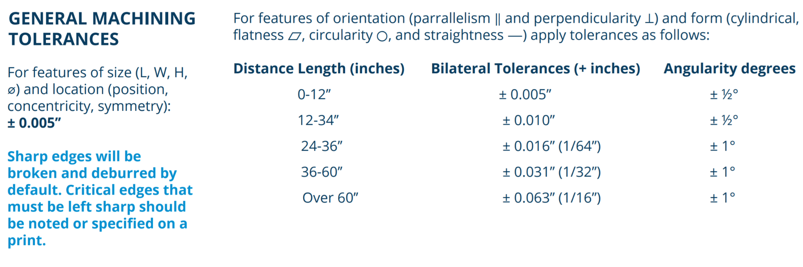

Given the dimensions of our project, it seems that applying a tolerance of ± 0.005" = 0.127 mm
everywhere might work.

To introduce tolerance, we modify the construction process described above. While we were
going through the extrusion process for one of the mating parts, and filling the remaining space
to obtain the other one, now we are going to extrude the tolerance space, and then using the
free space on either side to obtain the actual parts. With that in mind, we start by creating the
matrix as the difference between the inner and the outer one.

Inner matrix:

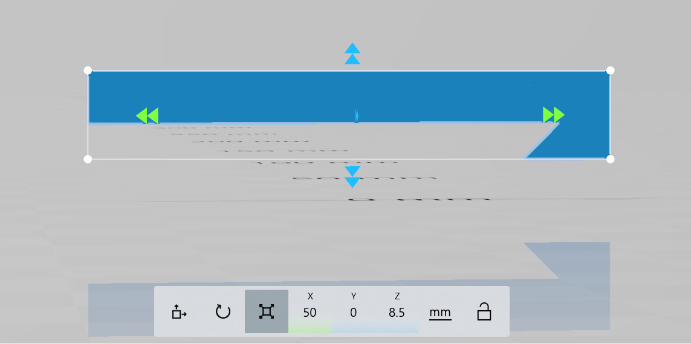

Outer matrix:

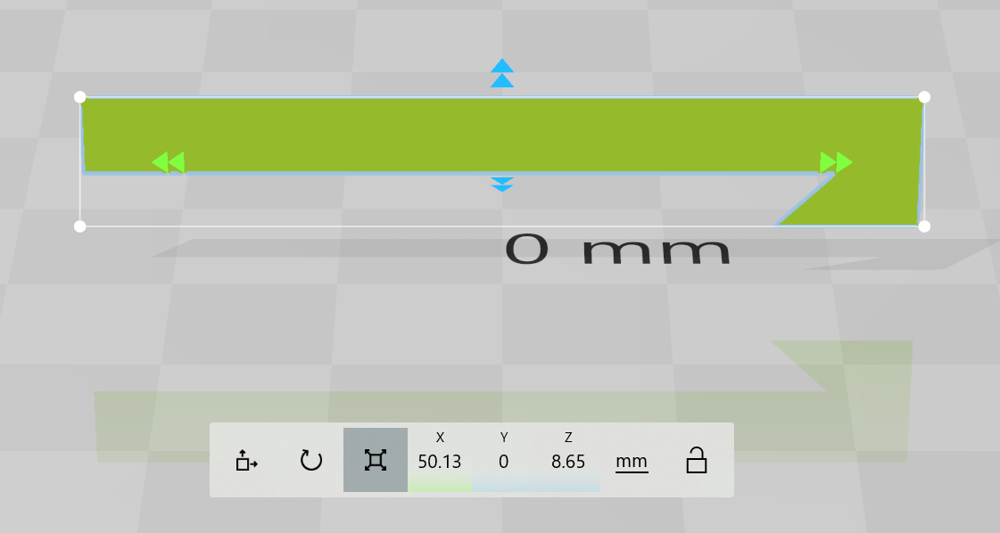

The difference in the longer side (0.15 instead of 0.127) is adopted to make extra room for
diagonals and various curves.

In the end, the new matrix is simply composed of three thin rods joined together:

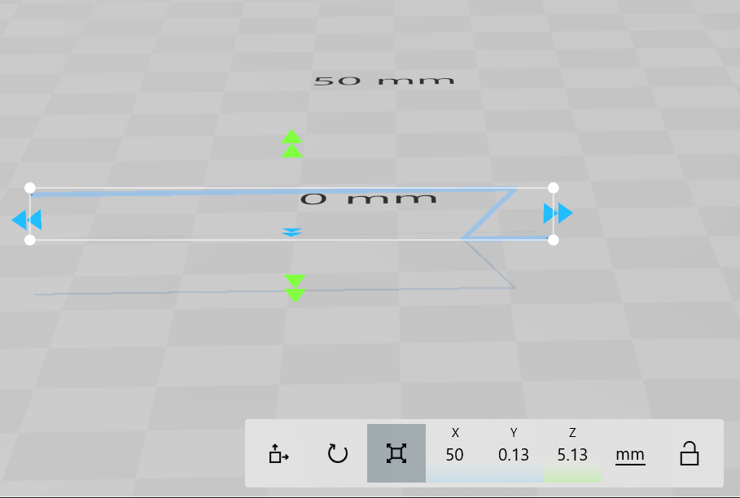

And this is our "polygon box" — that is, the apparatus before the extrusion:

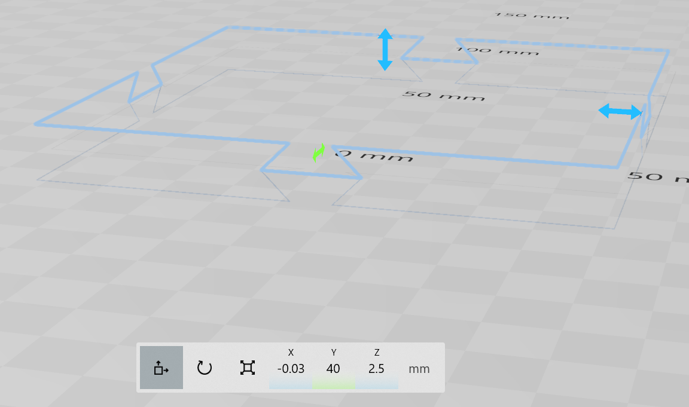

## Part 4 — The Blender attempt (original notes)

Thus far, I have used 3D Builder. Now I export the model in .STL format, to perform the
extrusion with Blender. After a few attempts, I found that rotating the polygon box and applying
the screw modifier along an external object I could get a nice, curved surface (external object is
the elongated cuboid in the background):

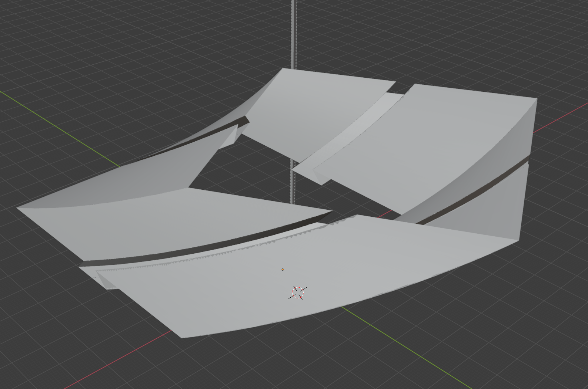

After exporting the component to .stl, and importing it back to Builder 3D we can obtain this
scene:

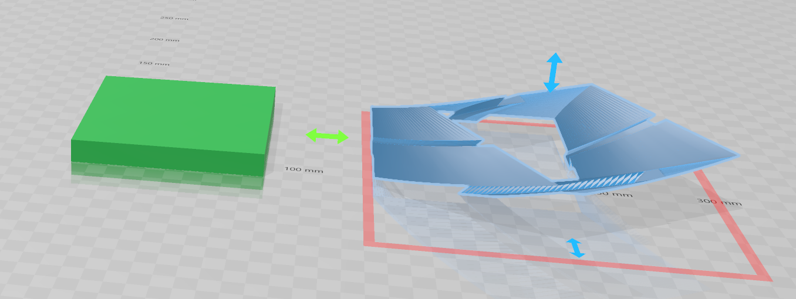

The green cuboid is the final volume for the apparatus, the blue one is the imported artifact.
Note the red square around it, something in its geometry seems to be problematic for 3D
Builder; but, activating the "Repair" function actually alters its geometry. I'm trying to go ahead
as it is, everything seems to be working so far. Checking out the intersection of the two artifacts:

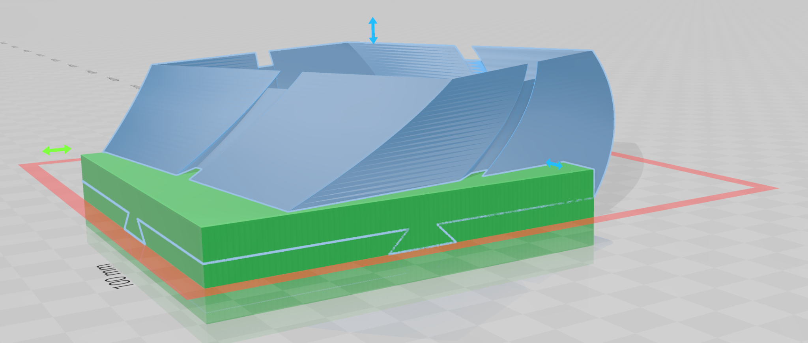

Everything seems to be correct from the opposite side as well:

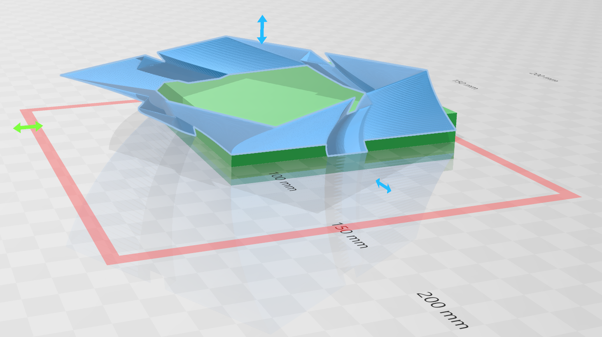

Next step: I need to add a bottom to my "cutting box" — the blue shape, that is.
The bottom is where I want to add some hidden information — in this case, a QR code pointing to
Francesco's LinkedIn profile. I generated the QR code using QRmonkey.org, but I could have
used the sharing feature in Chrome, etc., then I loaded it in 3D Builder and gave it a bit of 3D
relevance (see https://www.youtube.com/watch?v=plvNbWHi84Y)

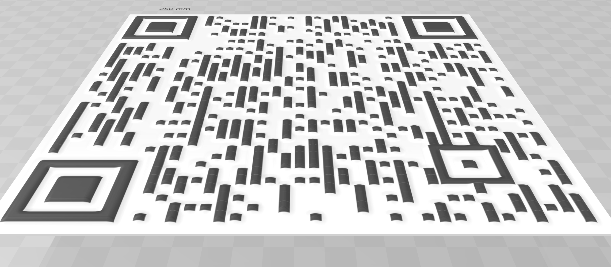

I am making sure that the angles of the 3D features in the bottom QR-code image need to be
flatter than whatever angles will come from the "cutting box":

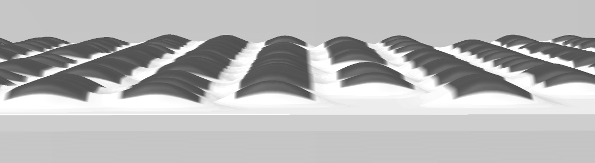

Working inside 3D Builder I was able to join the bottom with the QR code and the cutting artifact,
but I could not manage to cleanup the material in excess from the bottom:

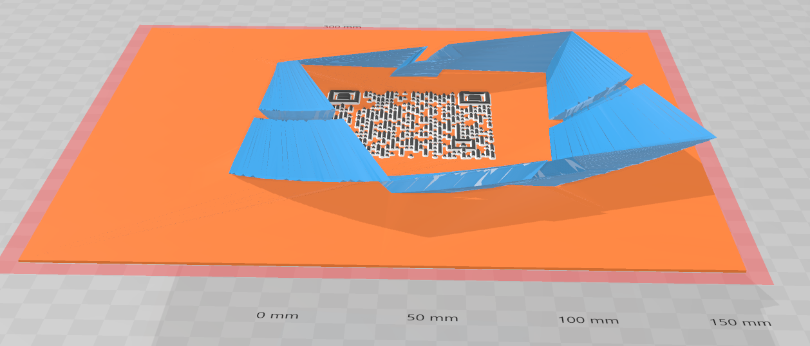

So I exported the shape to STL and loaded it in Blender.

Then, with some hours of mesh work in Blender, I completed the cutting box which now includes
the bottom with QR code:

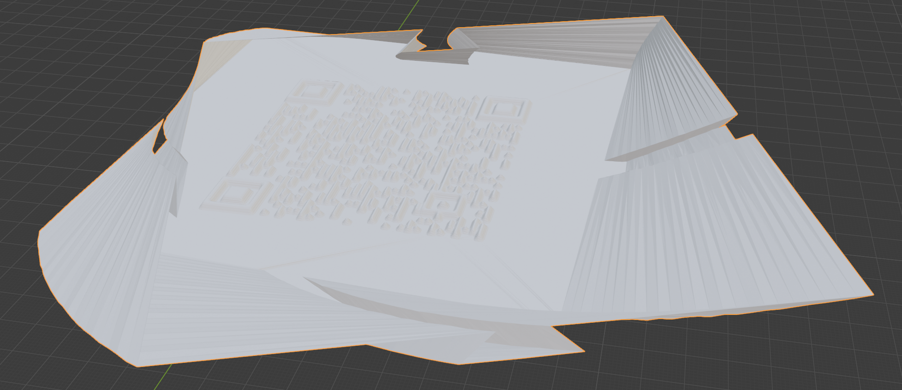

Since this shape has been entirely generated using a base shape that has a slightly larger width
than the known material tolerance, I can hope that removing it from the base box I will get two
mating parts; of course, the mesh is always an approximation but I can hope that in the worst
case I'll have to sand them a little.

OK, I'm saving this one just because I think it is cool:

---

*The notes stopped here. Everything below completes them.*

---

## Part 5 — What was still missing

The notes ended with a cutting box that "should" work, plus three open problems:

1. **No proof.** "I can hope that removing it from the base box I will get two mating parts" — hope,
   not verification. Nothing guaranteed that the two parts actually separate with one movement,
   or that they even come out as two valid solids.
2. **Fragile pipeline.** The Blender screw modifier produces an *open* surface (its ends are not
   capped), which is why 3D Builder drew the red warning frame and why "Repair" altered the
   geometry: repair tools cap and re-mesh non-manifold shells, changing the shape in the process.
   Hours of manual mesh work sat between the idea and a printable object, and every manual step
   could silently break the mating property.
3. **A hidden geometric trap.** The rule of thumb "features in the bottom must be flatter than
   whatever angles come from the cutting box" is necessary but **not sufficient** — see Part 12.
   With the screw-swept box of Part 4, a *flat* QR bottom is in fact not exactly separable near the
   plane through the screw axis; that is the subtle reason the manual assembly kept feeling harder
   than it should have been.

The completion below replaces hope with a construction that is correct *by construction*, and then
double-checks the result by simulating the disassembly motion on the final meshes.

## Part 6 — Why it works: one rule, one trick

**The rule.** Suppose the two parts separate by translating the top part along a fixed direction

> **d** = (d₁, d₂, 1)   (for example d = (0.7, 0.7, 1), about 45° off vertical)

Then the whole boundary between the two parts — the *parting surface* — must be visible "from
direction **d**": every straight line parallel to **d** must cross it at most once (crossing it along a
whole segment is also fine — that is a wall parallel to **d**, a sliding face). If some line parallel to
**d** entered the bottom part, left it, and entered it again, the top part would hook into the bottom
part and no translation along **d** could free it.

**The trick.** Instead of checking that rule surface by surface, change coordinates so it becomes
trivial. Define the **sheared coordinates**

> u = x − d₁·z    v = y − d₂·z    (z unchanged)

This shear maps every line parallel to **d** to a *vertical* line. So the rule becomes: *in sheared
coordinates, the parting surface must be a single-valued height field z = F(u, v)* — any height
field, with jumps allowed (a jump becomes a wall parallel to **d**, i.e. a sliding face).

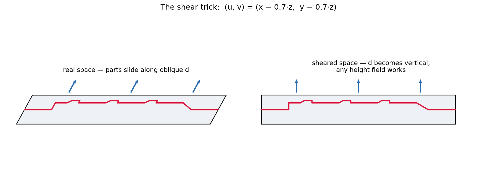

That single sentence is the entire theory of the U3T, and it proves the two claims from Part 2:

- **Arbitrary information can be encoded.** Any grayscale image whatsoever, interpreted as a
  height field in sheared coordinates, is a valid parting surface: QR codes, portraits, text —
  literally anything. Design your relief flat, shear it, done. In particular any artwork **extruded
  vertically in sheared space** (vertical walls become walls parallel to **d**) is separable *by
  construction* — no angle checking needed, ever.
- **Any number of sides ≥ 3 works.** The side keys are just more entries in the height field. The
  only constraint on **d** is the one already guessed in Part 2: **d** must not be parallel to any side
  face (its horizontal projection (d₁, d₂) must avoid the n side directions), so that every key
  actually withdraws *out of* its face instead of scraping along it.

And it explains the original two-groove family as the special case where the motion is horizontal
(a rotation about a vertical axis, or a straight slide as in Roger's): with no vertical component,
each groove must run all the way from one side to another, which is exactly why that family
carries no free space for information. Adding the third axis is what buys the freedom.

**Two robustness rules the height-field picture also gives us:**

- **Depth costs lean.** Anything that protrudes above the band *and shows on a side face* — the
  dovetail keys — can only be as deep (into the body) as `lean × height`: a key h mm tall can
  protrude at most `|(d₁,d₂)| × h` millimetres inward before the sliding motion would shear it
  off. A near-vertical **d** therefore produces wafer-thin keys no matter how they are drawn.
  With d = (0.7, 0.7, 1) and a 4 mm key, the tab is a solid ~2.8 mm deep — and 0.7 per axis is
  also the practical ceiling, because the leaning walls print at ~45°, the classic FDM limit.
- **Anchor what the stock crops.** Near the perimeter, the vertical columns of sheared space enter
  the block through a *side face*, not through the floor. A protruding feature there (a key tab)
  can end up connected to nothing once the stock box crops its leaning prism — it becomes a
  watertight but *floating* fragment, invisible to most mesh checks. The fix is structural: run
  every key tab into an **interior anchor rail** (same width, several mm inward, unioned before
  the clearance offset), so the visible tab is just the end of a solid internal rail — exactly
  like the tongue of a real sliding dovetail. And always verify the **body count**: each finished
  part must be one connected solid (Part 10).

## Part 7 — The reference design

The verified object completes the Part 3 project (straight extrusion line; for the "nice, creative
curve" upgrade and its extra constraint, see Part 12). All values are parameters and can be changed.

| parameter | value |
|---|---|
| stock | 100 × 100 × 15 mm |
| extrusion direction **d** | (0.7, 0.7, 1) — 44.7° from vertical, at the FDM 45° print limit |
| seam band height | z = 7.5 mm on all four faces |
| key (per face, centered) | trapezoid: 12 mm wide at the band, 20 mm at the top, 4 mm tall — solid tab ~2.8 mm deep; a 0.8 mm straight neck precedes the flare so the lip is ≥ 0.55 mm deep everywhere (DFM) |
| key anchor rail | 12 mm wide × 8 mm inward run per key, flat top at z 11.5 (Part 6 rule) |
| plateau | 45° (sheared) ramps from 68×68 @ z 7 to 60×60 @ z 11 |
| QR code | 29×29 modules, 1.24 mm/module, relief +1.2 mm, payload `Congratulations Francesco! UofT '22` |
| title / subtitle | relief +1.0 mm, DejaVu Sans Bold |
| clearance | ±0.15 mm per part (0.3 mm total gap) |
| signature | "pepi 2026", engraved 0.6 mm in the underside, mirrored to read from below |

The face profile — the "base shape for the half side" of Part 2, now dimensioned. The key belongs
to the bottom part and **flares upward**, so a straight vertical pull is impossible on every face,
while the flat band hides everything else. On the face the key merges with the bottom layer over
its full base width (it is the end of its internal anchor rail), exactly like a real dovetail:

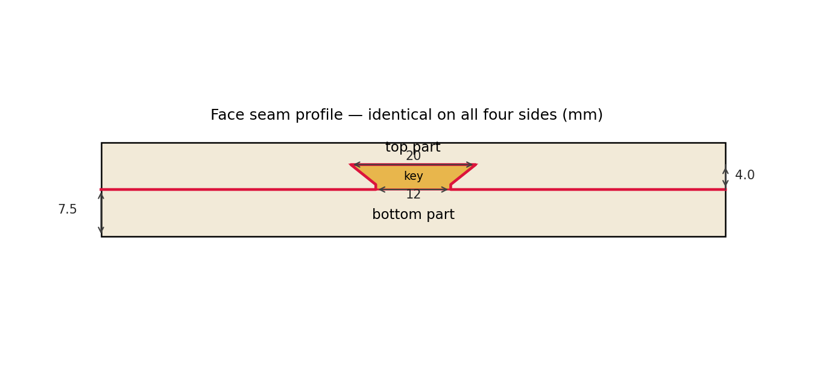

The parting surface, laid out as a plan in sheared coordinates. Each face key projects to a
quadrilateral just *outside* the z = 0 footprint (its prism leans back in through the face) and
continues inward as its anchor rail; QR and text are just black-and-white artwork dropped into
the plan:

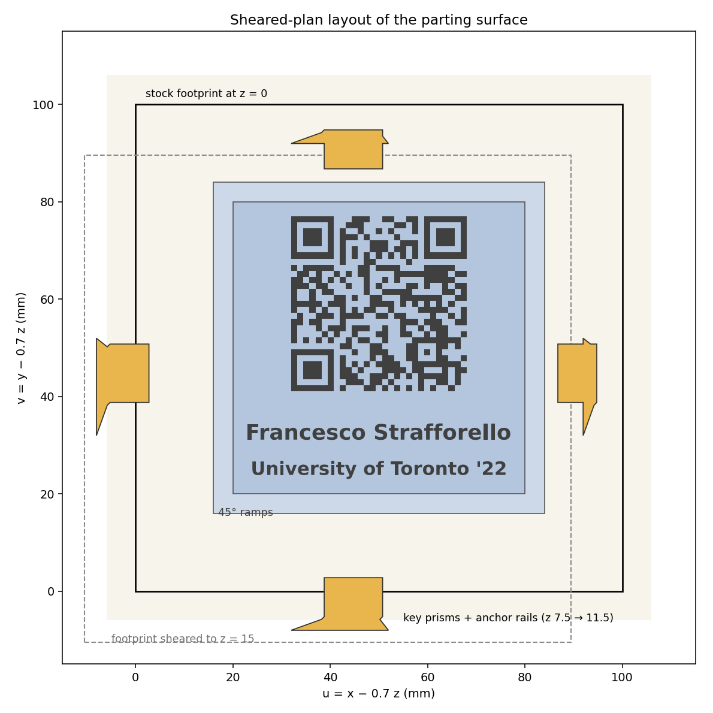

The resulting bottom part, and the interface it hides:

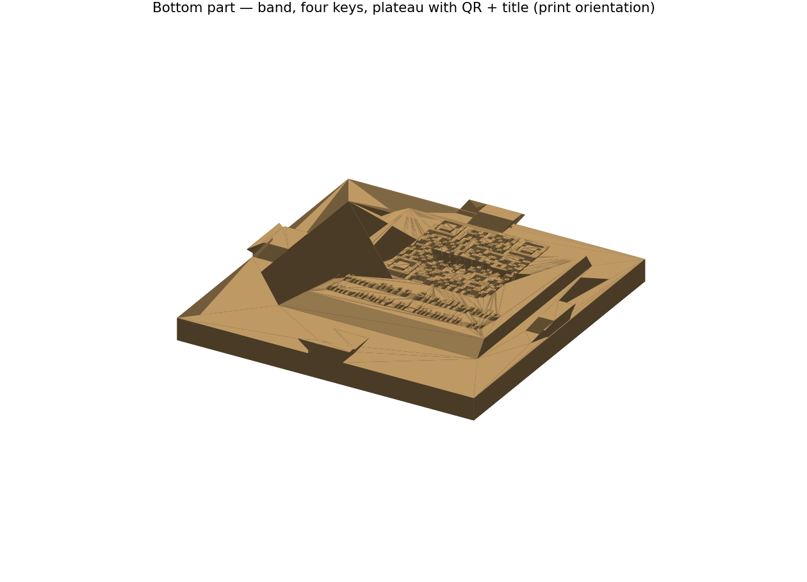

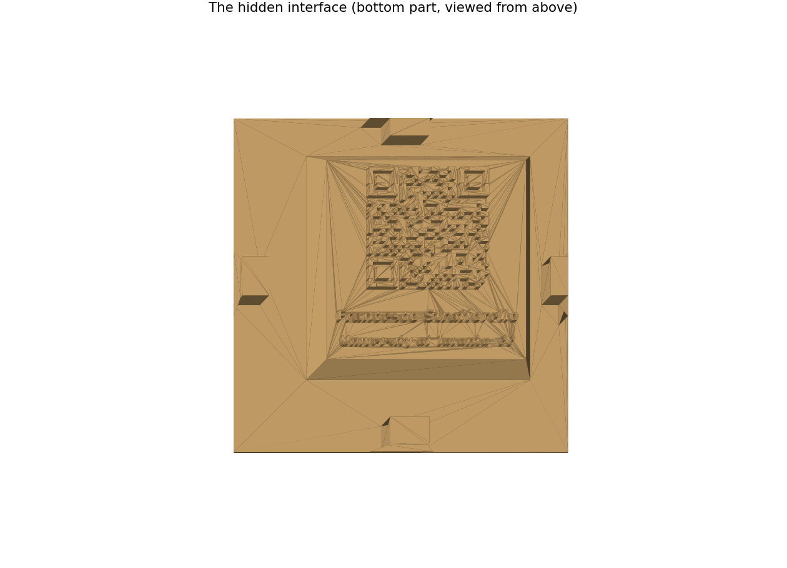

The top part is the exact complement (shown flipped, as it prints):

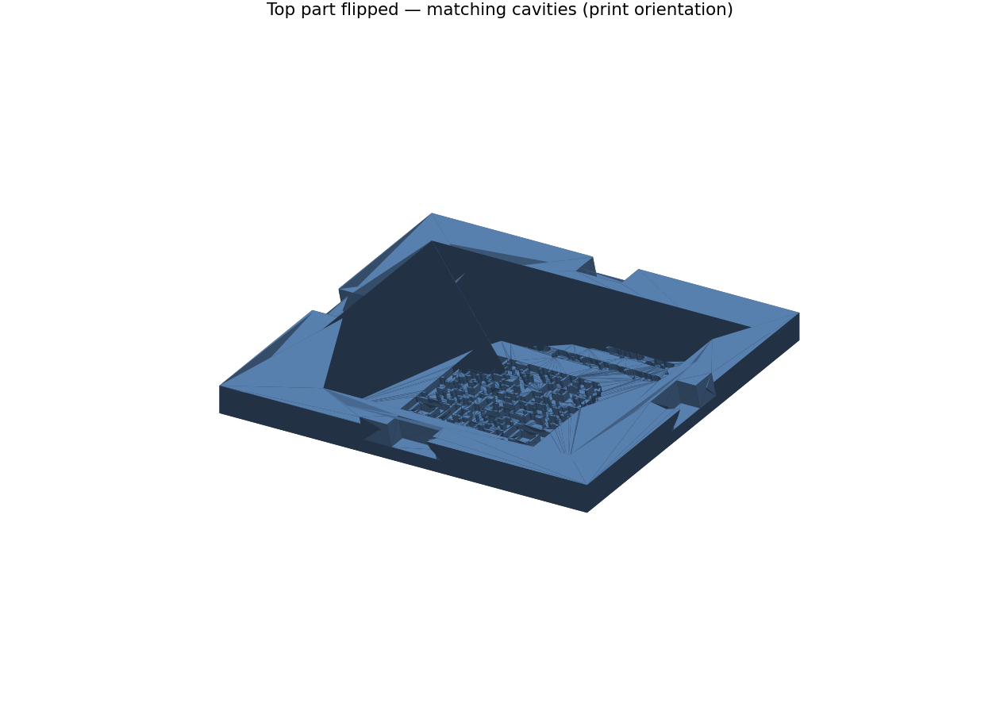

Assembled, exploded, and the single separating movement:

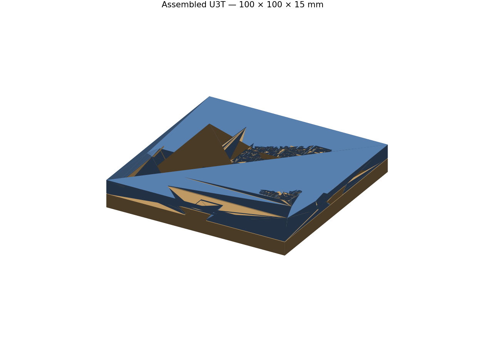

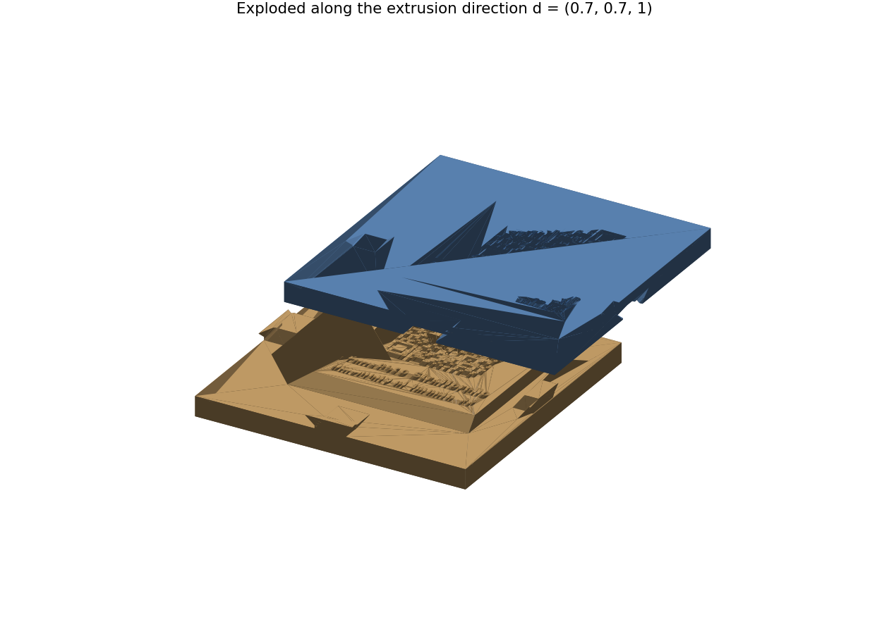

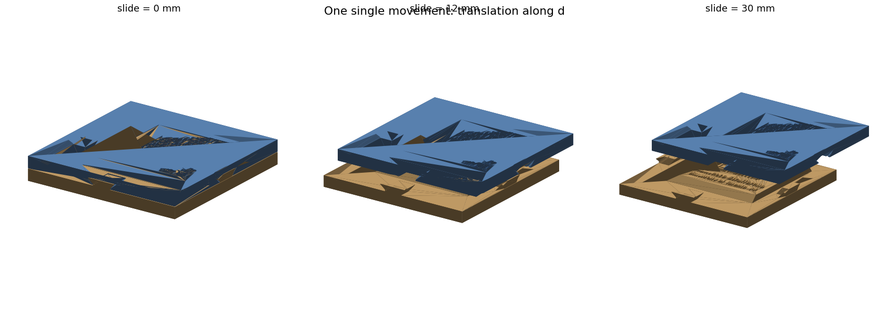

From every side, the classic look — a mid-height seam with a small dovetail, identical on all four
faces (the 0.3 mm clearance shows as the thin joint line, as on any printed puzzle):

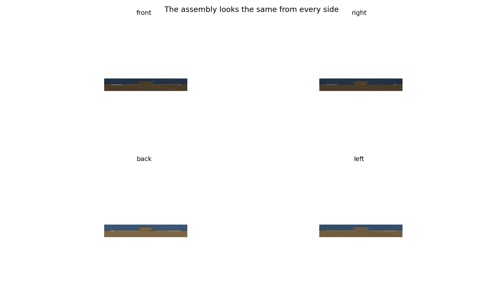

A cross-section through the middle shows the whole mechanism at once — band, the two keys leaning
along **d**, plateau ramps, QR relief, and the uniform gap:

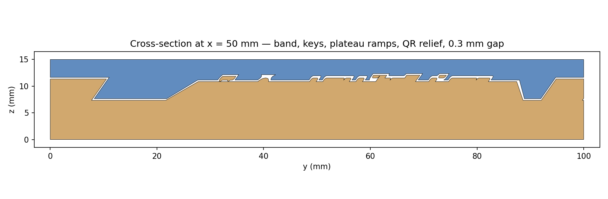

## Part 8 — Step by step in Autodesk Fusion

The construction from Part 6, translated to Fusion features. The strategy: model the **"Lower" solid**
(everything below the parting surface) once, parametrically, with a signed offset parameter `ofs`;
then obtain each part with one Combine against the stock box, evaluating `ofs` at −0.15 for the
bottom part and +0.15 for the top part.

**8.1 Setup**

1. New design, units mm. In **Modify ▸ Change Parameters** create user parameters:
   `L = 100`, `H = 15`, `band = 7.5`, `keyH = 4`, `keyW0 = 12`, `keyW1 = 20`,
   `dx = 0.7`, `dy = 0.7`, `railLen = 8`, `ofs = -0.15`.
2. **Stock**: sketch an L × L square on the XY plane, corner at the origin; Extrude `H`.
   Rename the body `Stock`.
3. **The direction path**: create a 3D sketch (Sketch ▸ Create 3D Sketch), draw a single line from
   `(-8, -8, -20)` to `(dx*40+8, dy*40+8, 40)` — a line along **d** extended well beyond the stock.
   Rename it `Path`. *Every* sweep in this recipe uses this one path; that is what guarantees all
   features share the same disassembly motion.

**8.2 The Lower solid**

4. **Base slab**: offset plane at z = −5; sketch a rectangle from (−30, −30) to (L+30, L+30);
   Extrude up to a height of `band + ofs − (−5)`, i.e. distance `band + ofs + 5`, as a **New Body**
   named `Lower`.
5. **Keys** (four sweeps, one per face):
   - Sketch on the front face plane (the XZ plane): draw the key trapezoid centered at x = L/2 —
     width `keyW0` at z = `band`, width `keyW1` at z = `band + keyH`. Apply a sketch **Offset** of
     `ofs` to the trapezoid (outward for positive).
   - **Create ▸ Sweep**, profile = the trapezoid, path = `Path`, extent: whole path, operation
     **Join** to `Lower`. The sweep makes the key an oblique prism along **d**; everything
     falling outside the stock is discarded later by the final Combine.
   - Repeat on the right, back and left face planes. Do **not** use a circular pattern — a pattern
     would rotate the sweep direction, which must stay identical for all four keys.
6. **Anchor rails** (the Part 6 rule — one per key; without these the printed tabs would be
   orphaned wafers). On an offset plane at z = `band − 1` sketch a `keyW0 + 2·ofs` × `railLen`
   rectangle, centered on the key's face position and starting just outside that face (for the
   front key at z = 6.5 and dx = 0.7: x from 44.4 to 55.6, y from −0.7 to `railLen` − 0.7 — the
   0.7 = `dy · (band − 1 − 6.5 + ...)` shift simply follows the Path; easiest is to project the
   swept key and snap the rectangle to its base edge). **Sweep** the rectangle along `Path`
   (Join), then **Split Body** with a plane at z = `band + keyH + ofs` and delete the part above,
   so the rail's top is flat and flush with the key top.
7. **Plateau**: offset planes at z = 7 and z = 11; on them sketch concentric centered squares 68×68
   and 60×60 (each offset by `ofs`); **Create ▸ Loft** between them, Join to `Lower`. (Even at the
   44.7° tilt of **d**, a 45° ramp still opens up during the motion — **d**·**n** > 0 on all four
   ramps — so this unsheared frustum satisfies the Part 6 rule.)
8. **QR + text**: on the z = 11 plane, **Insert ▸ Insert SVG** with the QR artwork, and use sketch
   **Text** (any bold font) for the title and subtitle. Select all profiles and **Sweep** them along
   `Path` (Join), then trim them flat: **Split Body** with an offset plane at z = 12.2 (QR) / 12.0
   (text) and delete the upper slivers. The sweep — *not* a vertical extrude — is what makes the
   relief walls parallel to **d**; a vertical extrude here would produce a part that jams (Part 6).
   Hand-offsetting hundreds of QR profiles by `ofs` is impractical; for a QR interface prefer the
   generator of Part 9, or accept a coarser relief (enlarge the modules and skip their offset —
   the 45°-equivalent gap of the plateau still dominates the fit).
9. **Signature** (optional): sketch mirrored text on the bottom face, Extrude −0.6 mm, **Cut**.

**8.3 The two parts**

10. Set `ofs = -0.15`. **Combine**: target `Stock`, tool `Lower`, operation **Intersect**, *Keep
    tools*, *New Component* → export this body as `U3T_bottom`.
11. Edit `ofs` to `+0.15` (the timeline recomputes every sketch and sweep). **Combine**: target
    `Stock`, tool `Lower`, operation **Cut** → export as `U3T_top`.
12. **Check before printing**: with both bodies at `ofs` mismatched (bottom at −0.15, top at +0.15 —
    keep the exported copies), run **Inspect ▸ Interference** on the assembled position, then Move
    the top body by `t·(0.7, 0.7, 1)/1.404` for a few values of t (e.g. 1, 5, 15 mm) and re-run the
    interference check each time. Every check must report zero interference. Also confirm each
    exported part is **one connected lump**: a Fusion body can silently contain disjoint lumps
    after a Combine — load the STLs in the slicer and check its object list shows a single solid
    per file (Part 6, second rule).
13. Export each part with **3D Print / Save as Mesh** (STL or 3MF, fine refinement).

## Part 9 — Step by step, automated (and what it fixes)

The repository root contains `u3t_generator.py`, a ~400-line parametric generator that performs
the whole construction of Part 8 in about ten seconds (Python 3.11; dependencies in
`requirements.txt`). It is the tool that produced the shipped STLs:

1. builds the QR, the title, the subtitle and the four key footprints as flat 2D geometry;
2. extrudes everything **vertically** in sheared space (band slab, key prisms, plateau frustum,
   QR and text reliefs) and unites it into the `Lower` solid — twice, with −0.15 and +0.15 offsets
   (lateral offsets via 2D polygon offsetting, vertical via the extrusion heights: this is exactly
   the inner/outer-matrix idea from Part 3, applied everywhere at once);
3. applies the shear matrix (x = u + 0.7·z, y = v + 0.7·z) — turning every vertical wall into a
   wall parallel to **d**;
4. intersects with / subtracts from the exact 100×100×15 stock using **watertight boolean
   operations** (the `manifold3d` kernel — the same class of robust engine that 3D Builder's
   "Repair" only approximates);
5. engraves the signature and writes the STLs plus a verification report.

Every intermediate object is a closed manifold solid at every step, so there is no red warning
frame, no "Repair", and no hours of mesh cleanup — the pipeline that fought back in Part 4 simply
disappears. Change any parameter at the top of the file (payload text, key size, direction **d**,
clearance, even the number of sides via the key table) and re-run.

## Part 10 — Verification: the printed object cannot be flawed by luck

"Be accurate" means: do not trust the construction, test the meshes that go to the printer.
`u3t_generator.py` runs this suite on its own output (results for the shipped STLs):

| check | result |
|---|---|
| bottom part watertight, consistent winding | yes — 89 932 mm³, exactly inside [0,100]×[0,100]×[0,12.05] |
| top part watertight, consistent winding | yes — 56 138 mm³, exactly inside [0,100]×[0,100]×[7.65,15] |
| **connected bodies per part** | exactly 1 and 1 — no floating fragments |
| assembled overlap (boolean intersection) | 0.000000 mm³ |
| slide along **d**, 14 stations t = 0.05 … 40 mm | 0.000000 mm³ overlap at every station |
| **control**: pull straight up 1 mm / 2 mm | collides (61.1 / 102.8 mm³) — the keys lock, hard |
| **control**: flat diagonal slide 1 mm / 2 mm | collides (341.1 / 863.3 mm³) — Roger's move does not open it |
| thin-feature scan (`dfm_scan.py`, FDM 0.5 mm rule) | no free-standing feature below 0.5 mm on either part; the only sub-0.5 readings are solid-backed chamfer edges where the key flanks meet the faces |

The two control rows are the puzzle property itself, demonstrated numerically: the naive motions
jam, the one intended motion sweeps through the entire disassembly without ever touching. The
body-count row exists because it once failed: an early draft with a near-vertical **d** (0.4)
and no anchor rails produced keys that were watertight, collision-clean — and *detached* (visible
as separated tabs in any mesh viewer). Watertightness alone does not catch that failure mode;
counting connected components does.

## Part 11 — Printing and assembly

- **Files**: `stl/U3T_bottom.stl` (print as oriented) and `stl/U3T_top_print.stl` (already flipped
  exterior-side-down). Both parts print **without supports**: the leaning walls sit right at the
  classic 45° FDM limit (44.7°), the ramps are gentler, and all reliefs face up on the bed.
- **Settings**: PLA, 0.2 mm layers (0.12 mm makes a crisper QR), 3 perimeters, ≥15 % infill.
  Enable elephant-foot compensation (~0.1 mm) or lightly deburr the first-layer edges — the band
  and the side faces must mate flush.
- **Fit**: the 0.3 mm total gap is a snug sliding fit on a well-tuned printer, in the spirit of the
  ±0.127 mm from Part 3 with a little extra for FDM reality. If it binds, sand lightly or reprint
  with `CLR = 0.20`; for a loose "demo" fit use 0.25.
- **Minimum feature policy (DFM)**: interface artwork uses an *asymmetric* clearance — the raised
  text and QR keep their full nominal width (every stroke ≥ 0.55 mm after a morphological
  opening), and the mating cavities take the whole 0.3 mm, with sub-0.5 mm walls between
  neighbouring letter cavities fused away. The key flare starts above a short straight neck so
  the lip depth never falls below 0.55 mm. The only sub-0.5 mm readings a wall-thickness checker
  will still report are the tapering solid-backed edges where the flared flanks meet the side
  faces — the printed result is a slightly rounded lip edge, present in every joint of this
  family, with no structural or fit consequence.
- **Assembly**: rest the top part over the bottom, offset about +10 mm in x and y, and lower it
  along the diagonal (45°); it seats flush with one smooth push. Because the lean of **d** breaks
  the square's symmetry, **only one of the four rotations engages** — a nice extra beat for the
  puzzle: the solver must find not only the motion but the orientation.
- **The reveal**: separate, and the plateau shows the title, the subtitle and the QR code. Relief
  QR codes scan best under raking light; a soft pencil rubbed flat across the module tops makes
  them scan instantly. To point it at the family album, put the URL in `QR_PAYLOAD` and re-run the
  generator (shorter URLs give coarser, easier-to-print modules).

## Part 12 — The "nice, creative curve", done right

Part 3 asked for a curved extrusion. The theory of Part 6 carries over: a constant-curvature
extrusion means the disassembly is a **screw motion** (rotation about an axis, possibly with pitch;
the straight line is the zero-curvature member of the family). Replace "lines parallel to **d**"
with "orbits of the screw motion", and the shear with the cylindrical unwrapping around the axis:
the parting surface must be single-valued along the orbits, walls must be surfaces swept *by* the
orbits (coaxial cylinders / helical ruled surfaces), and every side face must satisfy the exit
condition — the orbit velocity must point out of the face across the whole key.

One genuine subtlety, and the resolution of the Part 4 trap: wherever an orbit runs **parallel** to
the parting surface — for a horizontal rotation axis, this happens along the whole vertical plane
through the axis — a *flat* lid is tangent to the orbits, and the orbits curve down *into* it on
either side. A flat QR floor under a screw-swept box is therefore never exactly separable; it only
worked "so far" in Part 4 because mesh approximation and sanding absorbed the interference. The fix
is to curve the lid into a surface coaxial with the screw axis (bend the QR plane into a cylinder
patch) — or to keep the information on a flat plateau and give the *frame* the curve, which is the
compromise chosen for the verified reference object: provably correct today, curved edition ready
whenever the family demands a sequel.

## Part 13 — Files in this repository

| file | purpose |
|---|---|
| `docs/The-Unnamed-3D-Thingy.md` | this document |
| `docs/original-design-notes.pdf` | the original notes reproduced in Parts 1–4 |
| `docs/figures/original/*.png` | figures recovered from those notes |
| `docs/figures/gen_*.png` | figures generated from the actual shipped geometry |
| `docs/article/` | the same story told as an article, with its own images |
| `u3t_generator.py` | parametric generator + verification suite |
| `dfm_scan.py` | independent minimum-feature scan (Part 11) |
| `u3t_figures.py`, `tools/*` | figure, render and article tooling |
| `stl/U3T_bottom.stl` | bottom part, print-ready |
| `stl/U3T_top_print.stl` | top part, pre-flipped, print-ready |
| `stl/U3T_top.stl` | top part in assembly orientation (for CAD/inspection) |
| `verification/verify_report.json` | machine-readable results of Part 10 |
| `README.md`, `requirements.txt`, `LICENSE`, `NOTICE` | how to run it, and under what terms |

---

## Part 14 — The rotation edition: the "nice, creative curve", realized

Part 3 asked for the extrusion to follow "a nice, creative curve instead of a predictable and
boring straight line", and Part 4 attempted it with Blender's screw modifier before the notes
broke off. This chapter finishes that thread. The result is a second, fully verified pair of
printable parts with the same contract as the straight edition — identical dovetail seam on all
four faces, hidden QR + title interface, one single movement — except the movement is now a
**rotation**: the top part rolls open along circular arcs about an axis outside the block. A
circle is the constant-curvature curve the notes wanted; the straight line of Part 7 is just its
infinite-radius limit.

**14.1 Where the axis may go — three placement rules.** For a rotation about an axis **A**, the
orbits (the circles points travel along) replace the straight lines of Part 6, and the parting
surface must be crossed at most once per orbit. That, plus the requirements of the puzzle, pins
down where the axis can be:

1. **Not parallel to any side face** — otherwise the two faces parallel to the orbit planes can
   only carry grooves that surface on those faces, spoiling the identical-faces illusion. This is
   exactly the constraint stated in Part 2. So the axis runs **diagonally** in plan.
2. **The apex plane must miss the block.** The vertical plane through the axis is where orbits
   turn around (rise on one side, fall on the other). If it crosses the block, flat surfaces are
   crossed twice by some orbits and the parts jam — the Part 12 trap, and the hidden reason the
   Part 4 Blender attempt kept feeling harder than it should have. Placed so the apex plane
   clears the block, every orbit rises monotonically through it, and the flat band, plateau and
   relief tops of the straight edition become legal again exactly as they are.
3. **Far enough away to homogenize the slopes.** Orbit steepness varies across the block: shallow
   near the apex side, steep far from it. The axis distance is chosen so that over every
   wall-bearing region the orbit slope stays between ~43° and ~61° — walls lean at most ~46° from
   vertical (printable) and the keys keep useful depth on all four faces.

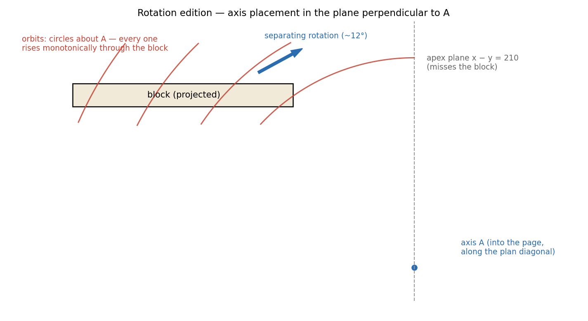

**14.2 The chosen geometry.**

| parameter | value |
|---|---|
| axis **A** | direction (1, 1, 0)/√2, through the point (105, −105, −103.5) |
| apex plane | x − y = 210 — about 100 mm beyond the nearest block corner |
| arc radius at block center | ≈ 185 mm (grooves visibly curved: ~7 mm of sagitta across the block) |
| opening motion | ≈ 12° of rotation frees the parts (verified clean out to 25°) |
| key (per face, centered) | 12 mm at the band → 20 mm at the top, **4.5 mm tall** (7.5 → 12.0), with a 1.3 mm straight neck before the flare (DFM: lip depth ≥ 0.55 mm even on the shallow faces) |
| key anchor rails | 12 × 8 mm, as in Part 7 |
| plateau | flat top 60 × 60 at z = 11, **orbit-swept curtain walls** (no 45° ramps) |
| QR / title / subtitle / clearance / signature | identical to Part 7 |

The construction is the Part 9 pipeline with one substitution: the linear shear becomes the
**bend map** — vertical design lines map onto orbits, so every design-space prism turns into a
curved-wall solid that slides along the rotation by construction. Two implementation details
matter. First, every footprint is defined as the **pre-image** of its true real-space position
(face trapezoids sampled on their faces, QR and text taken at the z = 11 content plane), so the
face seams come out exactly straight and the QR lands undistorted — naively drawing them in
design space would smear them by the varying orbit drift. Second, below the band the interface is
just the flat plane z = 7.5, so the slab is left as a plain straight box; bending it would only
introduce faceting error where none is needed (a sagging bent-cap facet was, in fact, the one bug
found and fixed during this chapter's verification).

**14.3 The result.**

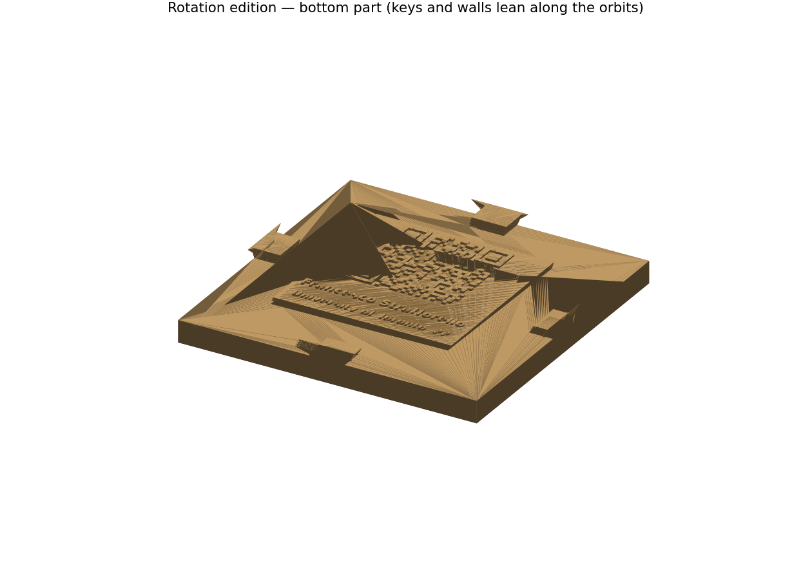

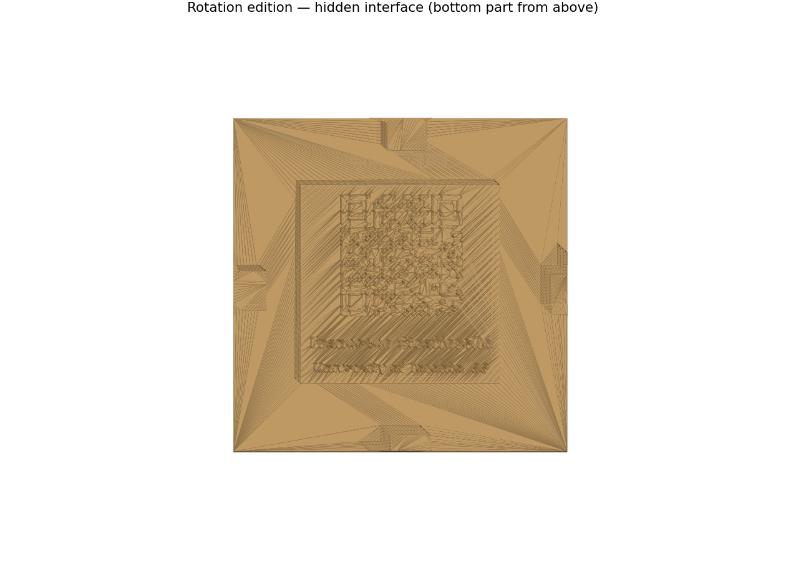

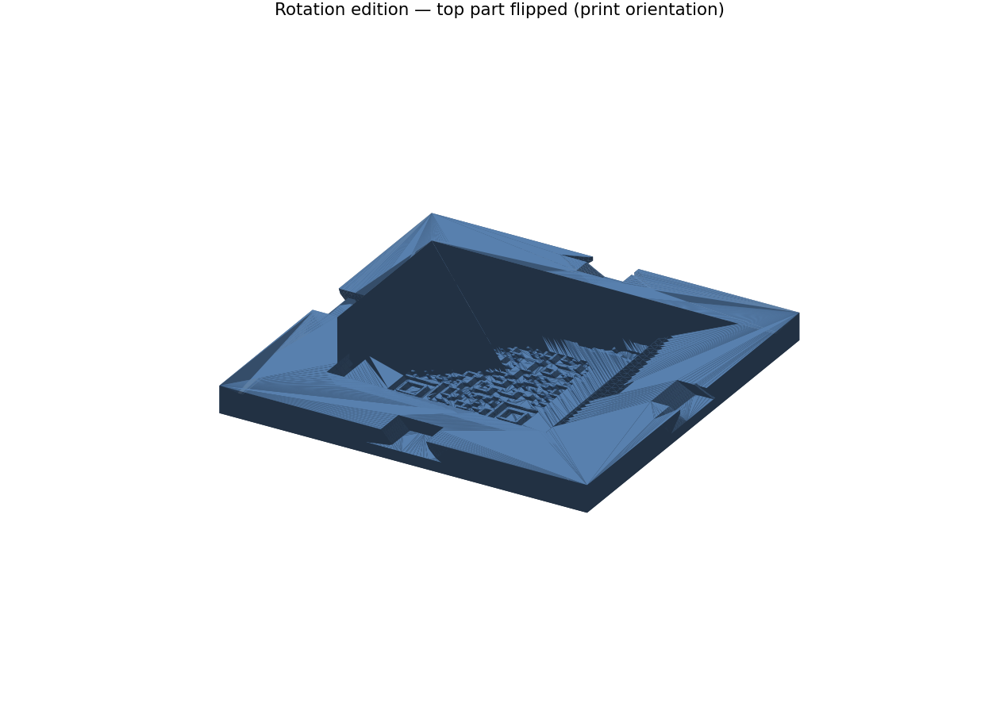

The one movement — a roll about the far diagonal:

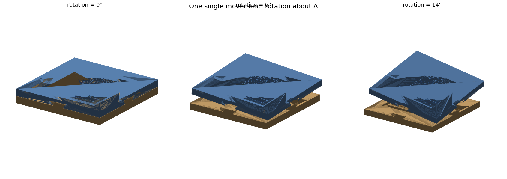

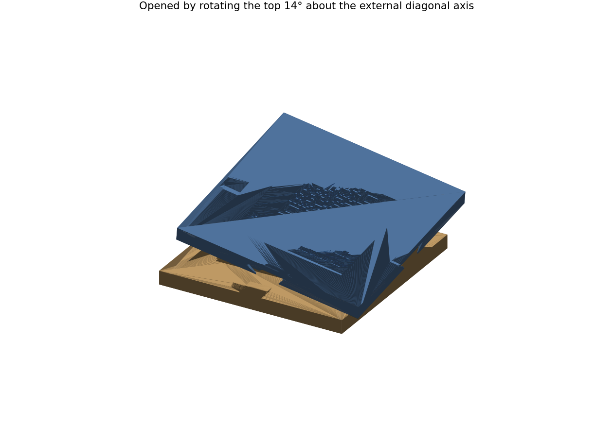

From outside, nothing gives the curve away — the four faces still show the same band and key:

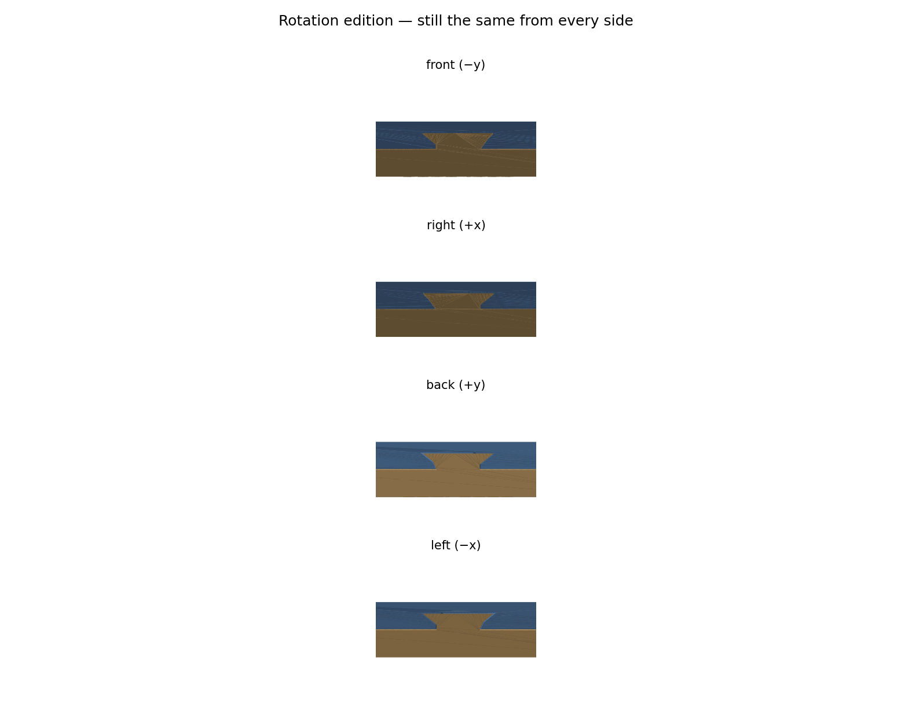

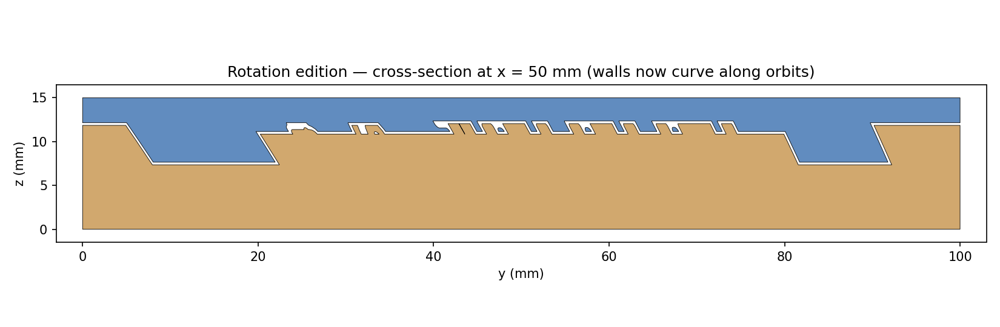

**14.4 What the curvature costs.** Two honest deltas against the straight edition. Key depth is
no longer equal on all faces: depth per millimetre of key height equals the ratio of the orbit's
face-normal component to its vertical component, which grows toward the apex — the two faces
nearer the apex get ~3.2 mm deep tabs, the two farther faces ~2.0 mm (the key was raised to
4.5 mm tall to keep the shallow pair robust; all tabs remain rail-anchored solids per Part 6).
And the plateau uses orbit-swept curtain walls instead of 45° ramps — with the slopes homogenized
by rule 3 these lean 29°–46° from vertical, so both parts still print support-free, but the
interface silhouette differs slightly from the straight edition's pyramid look.

**14.5 Verification** (same suite as Part 10, motion replaced by the rotation):

| check | result |
|---|---|
| bottom part | watertight, 1 body, 88 380 mm³, exactly [0,100]×[0,100]×[0,12.05] |
| top part | watertight, 1 body, 57 572 mm³, exactly [0,100]×[0,100]×[7.65,15] |
| assembled overlap | 0.000000 mm³ |
| rotation about **A**, 12 stations 0.05° … 25° | 0.000000 mm³ at every station |
| **control**: pull straight up 1 / 2 mm | collides (128.5 / 227.6 mm³) |
| **control**: flat diagonal slide 1 / 2 mm | collides (416.3 / 926.1 mm³) |
| **control**: the straight-edition slide **d** = (0.7,0.7,1), 2 / 5 mm | collides (282.1 / 73.8 mm³) — the curve is load-bearing: the old move does not open the new puzzle |
| **control**: reverse rotation 1° | collides (21 424 mm³) |
| thin-feature scan (0.5 mm FDM rule) | clean on both parts except the same solid-backed flank chamfer edges as Part 10 |

**14.6 Printing and playing.** Print exactly as in Part 11 (`U3T_rot_bottom.stl` as oriented,
`U3T_rot_top_print.stl` pre-flipped; no supports; same 0.3 mm total clearance). To open: hold the
bottom part and roll the top away over the corner between the front and right faces — a rolling
wrist motion about a horizontal diagonal line ~185 mm outside that corner. Only one of the four
orientations engages, and unlike the straight edition even the correct orientation refuses a
straight pull: the solver has to discover a *curved* motion, which is a satisfying extra step.
Solvers who met the straight edition first will find their old move jams (see the control row) —
the two objects look identical from every side and open differently, which makes the pair itself
a nice demonstration of just how large this family of solutions is.

**14.7 New files.**

| file | purpose |
|---|---|
| `u3t_rot_generator.py` | rotation-edition generator + verification suite |
| `u3t_rot_figures.py` | rotation-edition figures |
| `stl/U3T_rot_bottom.stl`, `stl/U3T_rot_top_print.stl` | print-ready parts |
| `stl/U3T_rot_top.stl` | top part in assembly orientation |
| `verification/verify_report_rot.json` | machine-readable results of §14.5 |
| `docs/figures/rot_*.png` | figures of this chapter |

*pepi's notes, completed August 2026. The U3T finally has everything except a name.*
