# The Unnamed 3D Thingy

## A wooden-block riddle, the family of infinite answers hiding behind it, and a 3D-printed gift with a secret inside

Years ago, my boss shared with me a book he wrote about critical thinking. One of its mental
exercises has been living rent-free in my head ever since. It goes like this:

> There is a block made of two different kinds of wood, mated so perfectly that there is no air
> between them. From every side, the assembly looks exactly the same: a seam at mid-height, with a
> small dovetail key in the middle of each face. The two layers can be separated with a single
> simple movement — no glue, no springs, no tricks. The same movement puts them back together.
>
> How?

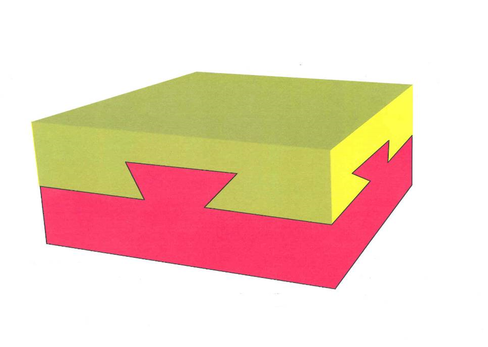
*The block. All four sides look like this. The dovetails say "you can't lift me"; the puzzle says otherwise.*

The dovetail on the front face says the top can't be lifted. The dovetail on the side face says it
can't slide sideways either. Every face you check makes the object more impossible. That's the
charm.

## The official answer

The solution in the book is the one beautifully modeled by Roger: the dovetails aren't dovetails.
They're the *ends of straight grooves* that run diagonally through the block, at 45° to every
face. Slide the top along that diagonal and it glides right off, while every individual face
insists to the end that no such motion exists.

*Roger's solution: two straight diagonal grooves. I really love it.*

## Not "the" solution

My observation back then — which I kept rummaging over for years — is that this is not *the*
solution, because the problem admits infinitely many. To prove the point, I built a different one
in 3D Builder, where the grooves are *arcs* instead of straight lines, had it printed, and gave it
to my boss as a semi-parting gift when he semi-retired.

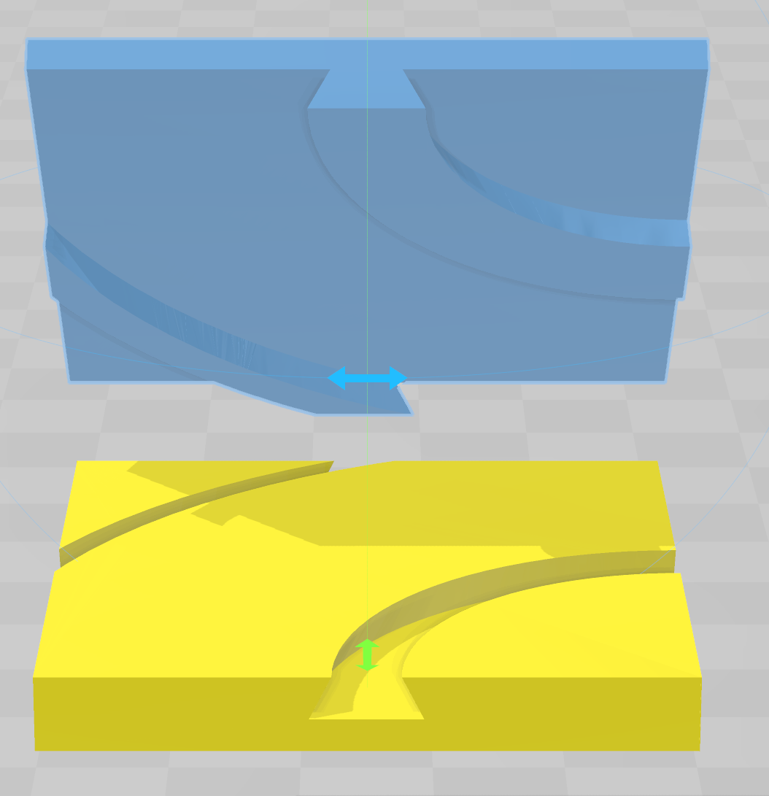
*My counter-example: the same four keys, but the grooves curve. The top comes off with a twist instead of a slide.*

Roger's straight grooves and my curved ones belong to one family: two grooves, each connecting a
pair of side keys, sweeping around a center that can sit anywhere from near the middle of the
square, to a corner, to infinity — where the arcs straighten into Roger's diagonals.

An infinite family, then. But a *cramped* one: two grooves have to cross the whole block, so the
shape is essentially forced. There is no room in it for anything else. In particular, there is no
room for *information*.

## Grooves on three axes

That bothered me, so I gave it more thought, and found we can do much better — the key is to stop
moving in a plane and start moving along all three axes.

Take the outline of the block's four sides — call it the *polygon box* — with a dovetail key drawn
on each side, and extrude it along a line that is oblique to *everything*: not parallel to any
face. Because the direction has components along all three axes, **each side gets its very own
groove**, independent of the other three. No more two-grooves-crossing-the-block. The four keys
are now just the visible ends of four short, private ramps.

*The polygon box after the oblique extrusion, cropped to the block: every side carries its own groove.*

Two consequences fall out immediately:

1. **The square is no longer special.** Three sides, five, seventeen — every side brings its own
   groove along, so any polygon works.
2. **The middle of the block is suddenly free real estate.** Once the perimeter does its job, the
   rest of the hidden surface between the two parts can be *anything* — which means it can carry
   an arbitrary amount of information. A message. A portrait. A QR code.

My quick proof-of-concept, "Hello!":

*The bottom part of the Hello block: four keys on the rim, and a whole plateau of free space in the middle.*

## Where I got stuck

Then came the family graduation, and the plan wrote itself: a 100 × 100 × 15 mm block for
Francesco — title, subtitle, and a QR code hidden on the inner surface, with the extrusion running
along "a nice, creative curve instead of a predictable and boring straight line."

The execution did not write itself.

My pipeline was 3D Builder for the solids and Blender for the sweep — the screw modifier, bending
the polygon box along an external axis:

*The screw modifier doing its thing. Pretty — and, as I would learn much later, subtly dangerous.*

It produced lovely curved surfaces and a trail of problems. 3D Builder drew red warning frames
around the imported meshes; its "Repair" function fixed them by *changing the geometry*. The
boolean cleanups refused to cooperate:

*Trying to trim the QR floor to the curved frame. The excess would not come off.*

Hours of manual mesh surgery later I had a cutting box I *hoped* would produce two mating parts —
"in the worst case I'll have to sand them a little." I saved one render because it looked cool,
and the notes stopped there.

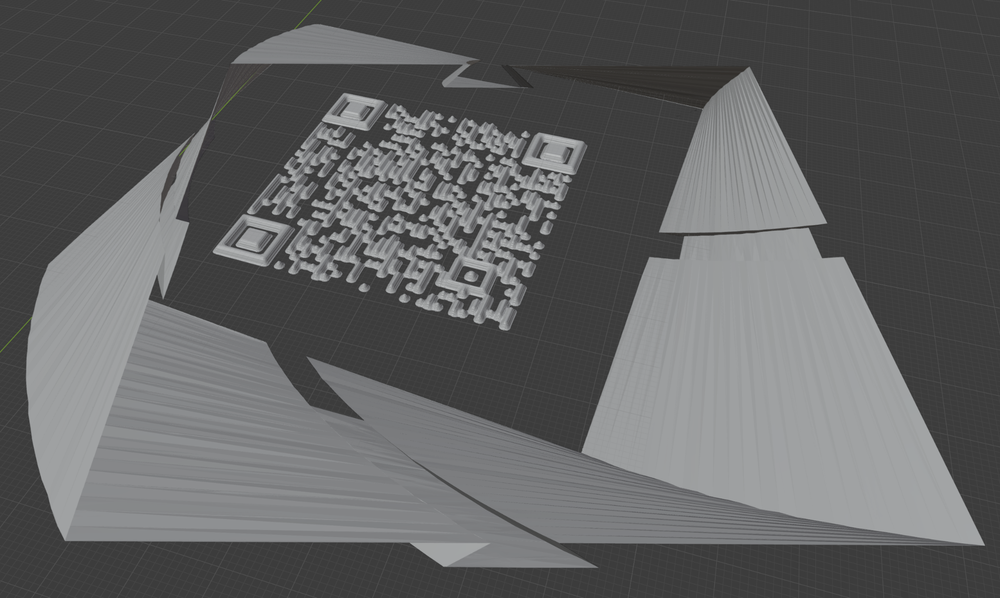
*The last image in my notes. It stayed the last image for four years.*

## The missing piece was a change of coordinates

What the project needed wasn't better mesh surgery. It was a proof.

Suppose the two parts separate by sliding along a fixed oblique direction **d**. When is a
proposed parting surface actually valid? Here's the whole theory in one move: **shear the world so
that d becomes vertical.** In sheared coordinates, u = x − d₁·z, v = y − d₂·z, the separating
motion is straight up — and a surface can be slid off vertically exactly when it is a plain
height field: one z per (u, v), cliffs allowed.

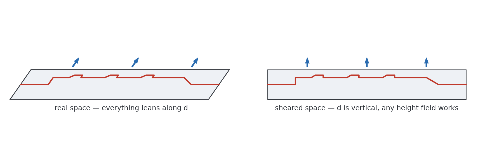
*Left: the real block, where every wall must lean along d. Right: the same block in sheared coordinates, where d is vertical and any height field is a valid parting surface.*

That single sentence settles everything the notes had left hanging:

- **Any information fits.** Take any relief — QR code, text, a portrait — extrude it straight up
  in sheared space, shear back, done. The walls come out parallel to **d** automatically. No angle
  checking, ever. (My old rule of thumb, "features must be flatter than the cutting box," was a
  shadow of this — necessary, not sufficient.)
- **The four faces stay identical.** The band and the keys are drawn on the faces, exactly as the
  puzzle demands, and swept inward along **d**:

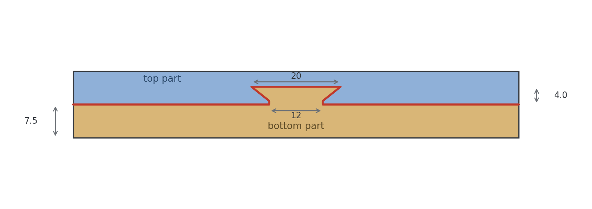
*The face profile, identical on all four sides. Band at 7.5 mm; a key 12 mm wide at the base, 20 at the top, 4 tall, standing on a short 0.8 mm neck — the neck's story comes later.*

- **The whole design becomes a drawing.** Here is the entire parting surface as a plan in sheared
  coordinates — four keys with their anchor rails, a plateau, and the hidden payload, which is
  literally just black-and-white artwork placed on the plan:

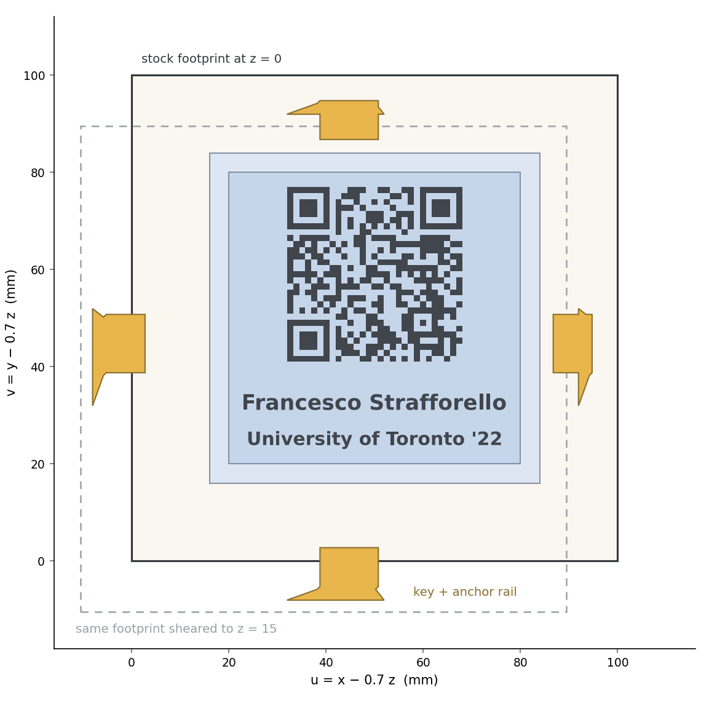
*The parting surface as a plan. The gold shapes are the four keys; everything dark is information riding along for free.*

So this time the object wasn't sculpted; it was *computed*. A small script builds both parts from
the drawing above — with a 0.3 mm clearance built in the same way my old notes built the
inner-and-outer "matrices", just applied everywhere at once — and produces watertight,
print-ready meshes in seconds instead of evenings.

## The proof of the pudding

Computed is nice. *Verified* is better — the same script then attacks its own output:

- both parts are watertight, single-piece solids that fill the exact 100 × 100 × 15 stock;
- assembled, their overlap is 0.000000 mm³ — and it stays exactly zero at fourteen positions along
  the entire slide-out path;
- and, my favorite part, the *negative controls*: pull the top straight up and the simulation
  reports a solid collision — the keys lock. Try Roger's flat diagonal slide: collision again.
  The puzzle property isn't an impression, it's a measurement.

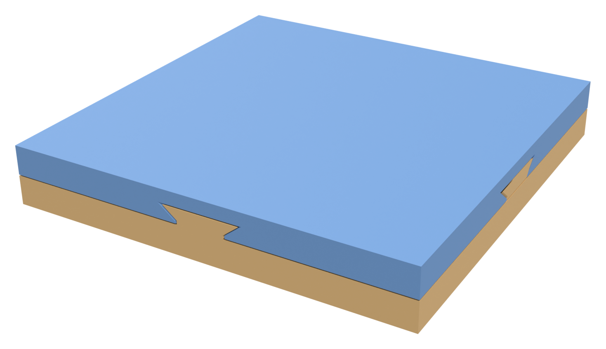
*The verified block. From here it's just a two-tone slab with dovetails.*

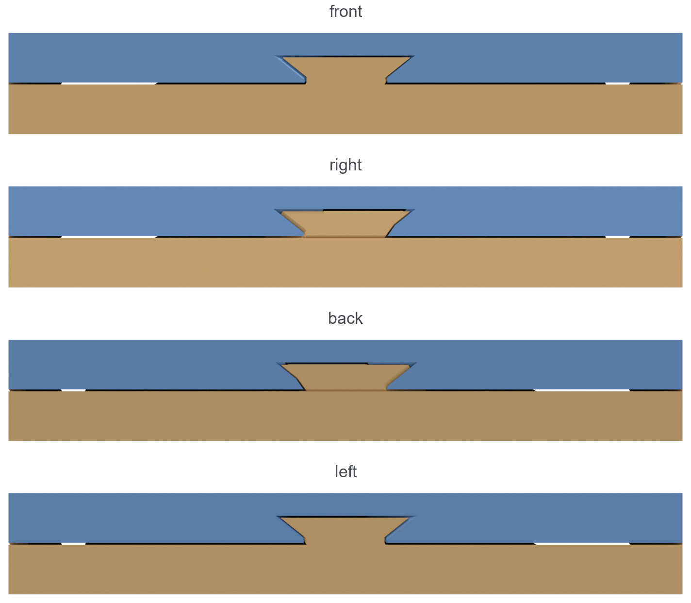
*All four faces, orthographic. Same band, same key, everywhere — the 0.3 mm joint line is the honest look of a printed puzzle.*

Slide it along the one direction it never admits to having, and:

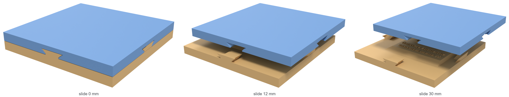
*One movement. The keys clear their sockets and the interior starts to show.*

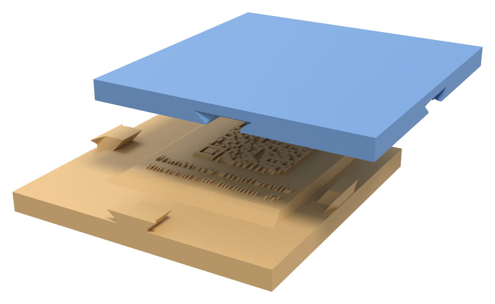
*Fully open.*

And the reveal — the reason the middle of the block was worth liberating:

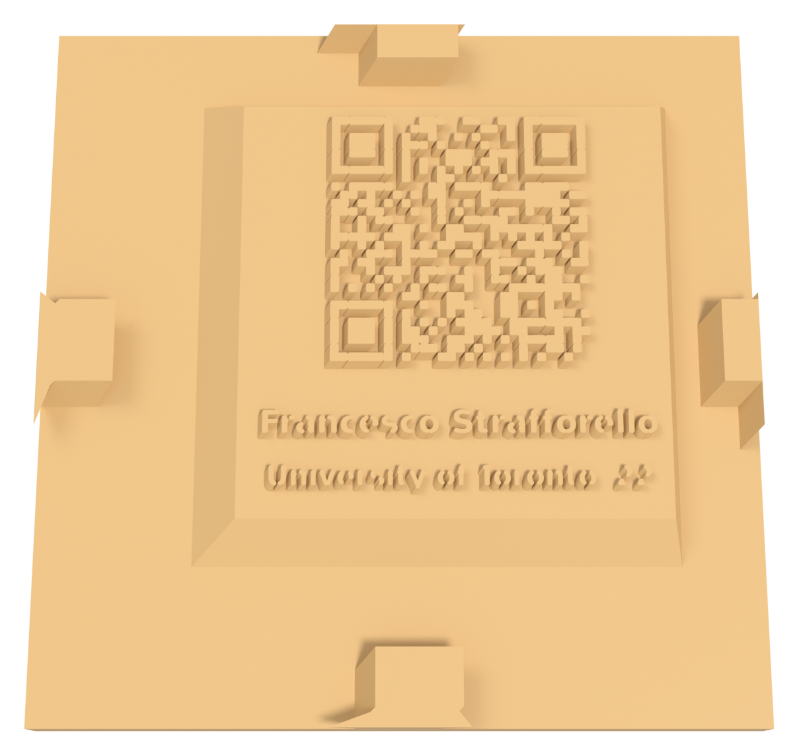
*The hidden interface: a QR code (it scans; raking light helps), a title, a subtitle. None of it visible from outside.*

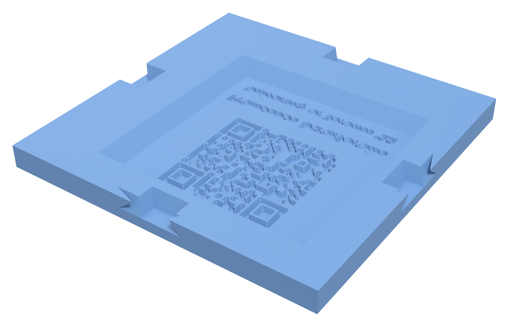
*The top part carries the same story in negative.*

A cross-section shows how it all stacks up — band, keys leaning on their rails, plateau, QR
relief, and the uniform clearance gap between the two colors:

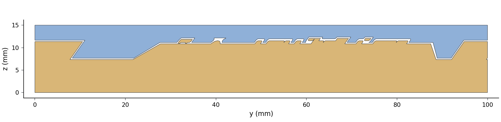
*Cross-section through the middle of the block.*

## What the first print taught me

Full disclosure: the first version of this design was flawed, and a mesh viewer caught it before
the printer did. Viewed from below, two of the dovetail keys floated free of the body — watertight,
collision-clean, and attached to *nothing*.

The cause is worth remembering. A key leans along **d**; the block's face crops it; and if the
lean is shallow, the crop takes the key's entire root with it. Every standard mesh check passes —
watertightness says nothing about your model being in one piece. Two rules came out of that
morning:

1. **Depth costs lean.** A key h mm tall can only stick out `lean × h` millimetres from the face.
   Near-vertical extrusions make wafer keys, no matter how you draw them. This design leans a full
   45° — which is also exactly what an FDM printer will tolerate without supports. That is not a
   coincidence; it's the design sitting on both limits at once.
2. **Anchor what the crop can orphan.** Every key continues inward as a solid rail, so the visible
   tab is the *end* of an internal beam, like the tongue of a real sliding dovetail — and the
   verification suite now counts connected bodies, because "watertight" and "in one piece" are
   different promises.

I thought that was the end of the humility. Then the files went to a printing service, and their
manufacturing review found two things my entire verification suite had happily blessed: walls a
tenth of a millimetre thick between neighbouring letter cavities — my clearance shaved every
stroke from both sides, and where two letters nearly touch, the material between their sockets
all but vanished — and key lips tapering below half a millimetre right where the flare begins.
Both fixes are in the published files: the artwork now takes its clearance *asymmetrically*, so
the raised letters keep their full width and the cavity absorbs the whole gap, and every key
stands on a short straight neck so its lip starts life a comfortable 0.55 mm thick (that's the
neck in the face-profile drawing above). Hence rule three: **verified is not the same as
manufacturable.** Geometry can be provably correct and still contain features no nozzle can
make — check minimum feature size the way the print shop will, because they will.

## The curve, done right at last

One thing remained from the graduation wish list: the *nice, creative curve*. A constant-curvature
extrusion means the opening movement is a rotation about an external axis — the straight line is
just the member of the family whose radius is infinite. My Blender attempt had chased exactly
this, and the shear trick explains precisely why it fought back: rotation bends the rules.

Three placement rules make it work:

1. the axis must run **diagonally** in plan — orbit planes parallel to a face would force grooves
   to surface on that face and spoil the identical-faces illusion (my old notes had guessed this
   constraint without knowing why);
2. the **apex plane** — the vertical plane through the axis, where orbits turn around — must miss
   the block entirely. If it crosses, flat surfaces get visited twice by the same orbit and the
   parts jam. *This* was the silent killer inside the screw-modifier build: a flat QR floor under
   a curved frame is never exactly separable if the axis sits underneath it.
3. the axis must sit **far enough away** that the orbit slopes stay printable everywhere a wall
   lives.

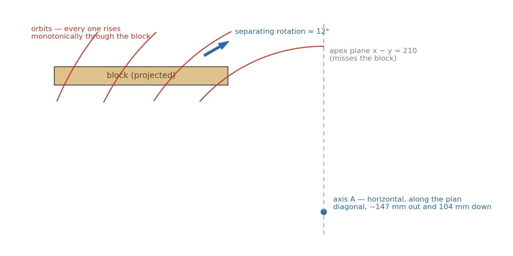
*The rotation edition's geometry: a horizontal axis along the plan diagonal, about 15 cm outside the block. Every orbit rises monotonically through it; ~12° of rotation opens the parts.*

With those rules, the same pipeline builds a second, fully verified pair of parts — same identical
faces, same hidden payload, but the walls now curve along circular orbits and the block opens with
a rolling motion over one corner:

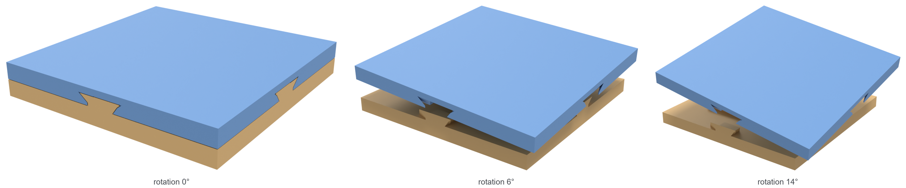
*The rotation edition opening. Note the tilt — this is a genuine rotation, not a lift.*

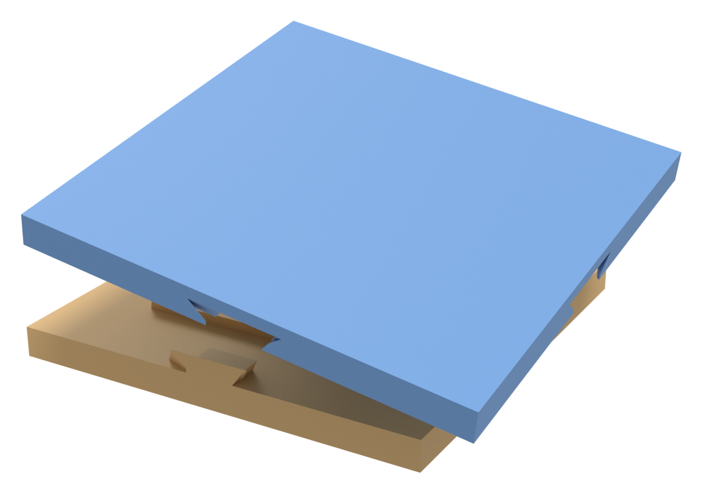
*Open, at 14° of rotation.*

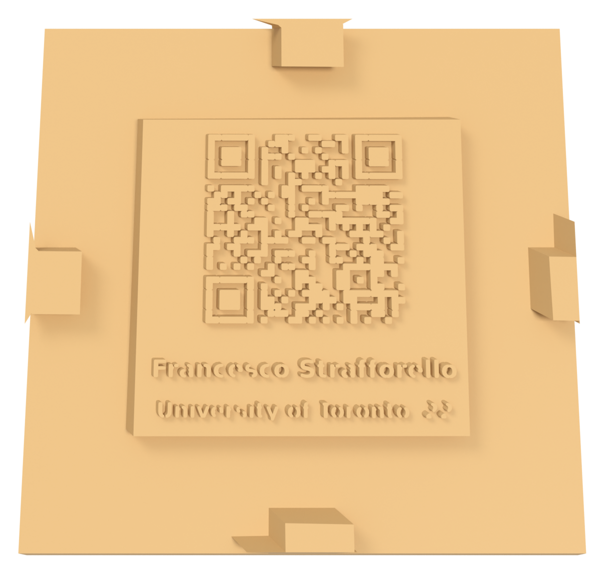
*Same secret, curvier custodian: every wall in this picture is a patch of a cylinder around the distant axis.*

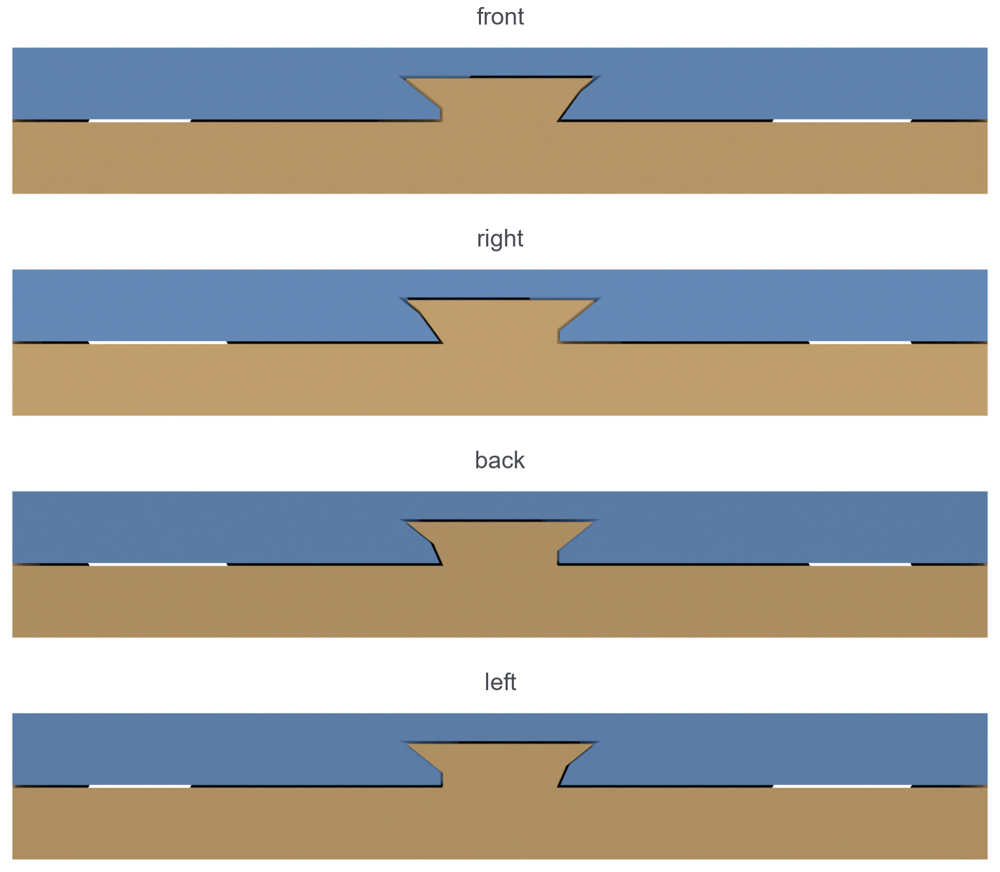
*And still: four faces, one look. You cannot tell the two editions apart from the outside.*

The controls got a new row, and it's my favorite measurement of the whole project: applying the
*straight* edition's opening move to the *rotation* edition jams solidly. Two objects,
indistinguishable from every side, each refusing the other's solution — a fitting way to
demonstrate just how large this family of "the" solution really is.

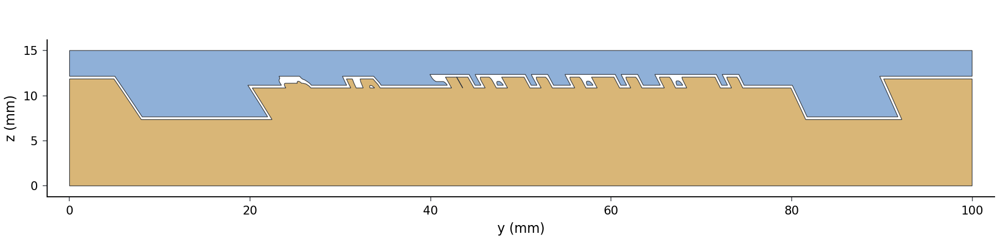
*The rotation edition in cross-section: same anatomy, gently curved bones.*

## Coda

The blocks print without supports — the bottom parts as they are, the top parts flipped on their
backs — in PLA at 0.2 mm layers, with a 0.3 mm built-in clearance that lands somewhere between
"satisfying" and "sand it a little", exactly as the original notes budgeted. Only one of the four
orientations engages; the other three are part of the puzzle. The full technical write-up — the
math, the step-by-step CAD walkthrough, the parametric generator, and the verification logs —
lives alongside the printable files *[here](https://github.com/pepistrafforello/U3T)*.

The gift finally exists twice over, four years late and provably correct, which I choose to call
even. It has a dovetail on every face, a rotation nobody can see, Francesco's name hidden in the
middle — and still, after all this time, no name of its own.
